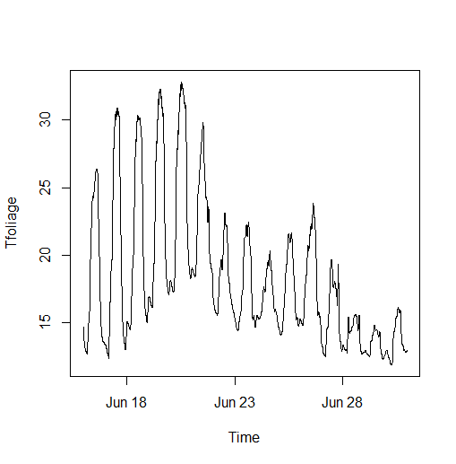

```{r, include = FALSE}
knitr::opts_chunk$set(
  collapse = TRUE,
  comment = "#>"
)
```
* [Background](#background)
* [Tree trunk model](#tree-trunk-model)
  + [Tree trunk model overview](#tree-trunk-model-overview)
  + [Tree trunk model inputs](#tree-trunk-model-inputs)
  + [Running the tree trunk model](#running-the-tree-trunk-model)
  + [Tree trunk model outputs](#tree-trunk-model-outputs)
  + [Plot tree trunk model results](#plot-tree-trunk-model-results)
* [Microclimate model](#microclimate-model)
  + [Microclimate model overview](#microclimate-model-overview)
  + [Microclimate model inputs](#microclimate-model-inputs)
  + [Running the microclimate model](#running-the-microclimate-model)
  + [Microclimate model outputs](#microclimate-model-outputs)
  + [Plot microclimate model results](#plot-microclimate-model-results)
* [Effects of time increment](#effects-of-time-increment)
  + [On tree trunk model](#on-tree-trunk-model)
  + [On microclimate model](#on-microclimate-model)

## Background
This vignette describes the R package ‘microtreetrunk’. The package contains a series of functions for modelling tree-trunk temperatures at a user-specified height above ground using a first-principles transient energy balance model. Tree trunk temperatures are modelled in user-specified time increments within user-specified segments and concentric rings. Inputs to the tree trunk model are detailed below, but comprise tree-trunk characteristics (diameter, thermal conductivity and emissivity, volumetric specific heat capacity and reflectance) and the outputs of a microclimate model (air and mean foliage temperature, relative humidity, wind speed and upward and downward direct, diffuse and longwave radiation flux densities). The microclimate model is described below.

## Tree trunk model

### Tree trunk model overview
The tree-trunk is divided into concentric rings and segments (Fig 1). The model is two-dimensional, so vertical gradients in temperatures and resulting heat fluxes are assumed negligible in comparison to horizontal gradients. Temperatures are derived at one height above ground only, determined by the user-specified height when running thte microclimate model (see below). Initially, the energy balance at the outer ring of each segment is calculated.  Absorbed shortwave radiation is determined from the surface reflectance of the tree trunk and from upward and downward diffuse radiation and downward direct radiation (upward radiation is assumed to be scattered by canopy elements with little directional bias, and hence diffuse). The absorption of direct downward radiation is assumed to depend on the angle of the surface of the tree trunk, which is assumed perfectly vertically orientated, but circular horizontally, such that the part of the tree-trunk facing the sun absorbs more direct radiation. Longwave radiation absorption is returned by the microclimate model, and assumed dependent on the thermal emissvity of the tree trunk surface. The sensible heat fluxes (convective heat exchange between the air and the tree trunk) are determined from wind speed and the difference between air and tree surface temperatures. Similarly latent heat fluxes (evaporative cooling) is determined from wind speed and the difference between air tree surface vapour pressures. The effective vapour pressures of the tree’s surface is determined from surface temperature and a rainfall-dependent coefficient that describes the fraction of the tree surface that acts like a saturated surface. Due to the interdependence of these fluxes and tree surface temperature, temperatures in the previous step are used. 

Once the net energy balance is calculates this is assumed to warm or cool the outer ring of the tree surface by an amount also contingent on the thermal heat capacity of the outer ring. Heat exchanges between segments and rings are then quantified from (i) temperature gradients, (ii) the surface area in contact, (iii) user-specified heat conductances and (iv) the distances between each adjoining layer or segment. Distances are defined, and hence temperatures derived for hypothetical nodes that lie at the centre of each segment within each layer. In the model fluxes are computed sequentially, but in reality they occur simultaneously and thus to avoid significant biases associated with the order in which these fluxes are calculated, it is necessary to run the model using relatively short time-increments. The effects of choice of time-increment on model outputs are described below. Further thoughts on enhancing the computational efficiency of the model are also presented. 


### Tree trunk model inputs
Two sets of inputs are required to run the tree-trunk model. Firstly, an object of class `microout` as returned by `runmicro` - i.e. a set of microclimate inputs as returned by the microclimate model described below. Secondly, a set of tree parameters. The inbuilt data,frame `treeparams` gives an example of the parameters needed: 

```{r}
library(microtreetrunk)
attributes(treeparams)
```

The dataset is a list of following:
* `nlayers` - the number of concentric layers into which to divide the tree trunk (>3).
* `nsegs` - the number of segments into which to divide each layer (>3).
* `tref` - the reflectance (to shortwave radiation) of the tree (0-1).
* `tem` - the thermal emissivity of the tree (0-1).
* `radius` - the radius of the tree (m).
* `K` - thermal conductivity (W/m^2).
* `cph` - specific heat capacity (MJ/m^3)

The thermal conductivity and specific heat capacity can either be provided as vectors of values for each layer or as single values, in which case these are assumed to be identical within each layer. Users wishing to construct their own inputs to the model should follow the format and units of the inbuilt dataset. 

To prepare the model, the function 'modelprep' is used, which creates an S4 object of class `treein`, which is later passed to the model run function:

```{r eval=FALSE}
modin <- modelprep(microout, treeparams)
```

Here, microout is an inbuilt dataset included with the package, and was created by running the microclimate model as detailed below. The treetrunk model works best if run in short time-steps. At this stage, users thus have the option to interpolate the microclimate input to a shorter time increment:

```{r eval=FALSE}
modinmin <- microspline(modin, secs=60)
```

Here, `modin`, originally at 5 minute time increments is interpolated to one minute  time increments. 

### Running the tree trunk model
The model is run using function `runtreetrunk`, but to illustrate how it works, we initially run the model for the first time-step only (`i = 1`) using function `treeonestep`:

```{r eval=FALSE}
modinmin <- treeonestep(modinmin, i = 1, fwet = 0.1)
```

Here `fwet` is the fraction of the tree trunk's surface acting like a saturated water surface, and controls the amount of evaporation. In later iterations of this model, this will be calculated implicitly. The function returns an an S4 object of class `treein` used as an input to the next iteration of the tree trunk model.

The entire model is run as follows:

```{r eval=FALSE}
treemodout <- runtreetrunk(modin, fwet=0.1, tomax=NA, daysinit = 1)
```

Here, to speed up the model run time,  we opt to run the model using `modin`, which is in 300 second time increments, but it could just as easily have been run using the higher temporal resolution `modinmin` object we created above. The parameter `tomax` indicates for how many time steps the model is run. If left at its default `NA`, as here, the model is run for the entire duration as determined by the input microclimate data. The parameter `daysinit` specifies how many days should be used as a burn-in prior to running the model. One day is usually adequate. The function effectively repeatedly calls function `treeonestep`, although within each time step, the re are some additional checks done to ensure temperatures are constrained within a plausible range to ensure the model doesn't de-stablise when too much heat is based between layers or segments. 

### Tree trunk model outputs
The function returns an S4  object of class `treemodout` - a list of the following: (i) `Tout` - an array of temperatures for each layer, segment and time-interval and (ii) `tme` a POSIXlt object of the corresponding times for each time-interval.

### Plot tree trunk model results
There are two options that can be used to plot results. Function `timeseriesplot` plots a time series of temperatures in the outer layer of the tree trunk, either the warmest or coldest segment, or the mean of all segments. Here we plot a time-series for the warmest segment of the outer layer, by specifying `fun = max`:

```{r eval=FALSE}
timeseriesplot(treemodout, fun = max)
```
\

Alternatively `fun = min` or `fun = mean` could have been specified.

The second option is plot a raster representing the cross-sectional temperatures of the tree-trunk in any given time-step using function `crossectionplot`. This function requires the packages `fields` and `raster` to be installed as
temperatures within each segment and layer, as returned by `runtreetrunk` are interpolated to a 100 x 100 pixel resolution using the `fields` prior to
plotting. In the code below, not run when building the vignette, `crossectionplot` is called repeatedly to give a visual representation of how temperatures evolve over the first two days of the model run. The displayed image is for 11:35 in the morning on the second day of the model run. Here the temperature range of the plot is set using `zlim`.

```{r eval=FALSE}
library(raster)
library(fields)
for (i in 1:576) {
  crossectionplot(modin, treemodout, i, zlim = c(12,35))
}
```
\

## Microclimate model
### Microclimate model overview
The microclimate model is also a first-principals mechanistic model based on energy balance and as a starting point requires standard weather data as inputs (see below). It is based fundamentally on Langrangian fluid dynamics. In a Lagrangian framework, a forest canopy is viewed as an ensemble of point heat or vapour sources (or sinks) each releasing a plume that is advected by the mean air flow and spread by turbulence. The resulting ensemble averaged air temperature or vapour pressure at any given height above canopy is determined from the distribution of heat or vapour sources and the probability that a fluid particle transporting heat or vapour originating at any given source, ends up at the point of interest. The major challenge in Lagrangian dispersion microclimate model is to express this probability in terms of wind speed. The microclimate model component of this package is based on the approximation method proposed by Rauapach (1989a, b). In his “localized near-field” (LNF) theory, he derived equations for calculating temperature or humidity as the sum of near-field and far-field contributions. The far-field contribution is influenced by the entire vertical distribution of heat or vapour sources within the canopy, whereas the near field contribution is the result of heat or vapour originating from foliage close to the point of interest. Using this method, and for the purposes of efficiently modelling microclimate, the canopy is assumed horizontally homogeneous. Resultantly temperature and humidity depend primarily on the vertical distribution of foliage.

The second challenge is to explicitly quantify heat and vapour sources and sinks in terms of foliage distribution. This is assumed using standard energy balance equations, whereby a leaf gains heat by absorbing radiation, loses it by emitting radiation and through evapotranspiration and loses or gains heat though exchanges with the surrounding air. To calculate absorbed shortwave radiation, a variant of the variant of the Dickenson-Sellers two-stream radiation model described by Yuan et al (2017) is implemented. Here, downward radiation through the canopy is attenuated by foliage in a manner determined by leaf area, leaf transmittance (i.e. how translucent the leaves are) and the orientation of leaves (with vertically orientated leaves attenuating more radiation when the sun is low above the horizon). A portion of this downward radiation is reflected back from the ground surface and is also back-scattered, which in turn is assumed to depend on the orientation, reflectance and transmittance of the leaves. Hence, in addition to a downward radiation flux, there is an upward flux absorbed by leaves on their underside. Longwave (thermal) radiation is handled in the same way as in the tree trunk model and is assumed to depend on foliage temperature (in the previous time step), effective sky temperature, ground surface temperature (as well as leaf area between the sky / ground and the point of interest). 

The loss or gain of heat from the surrounding air is assumed to depend air temperature (in the previous time-step) and convective conductance, the later dependent on leaf size and wind speed. Vapour exchange with the surrounding air is assumed to depend on air-leaf humidity and the convective conductance of vapour. The effective vapour pressure of the leaf is determined by assuming it to be saturated, such that it can be explicitly calculated from leaf temperature. The convective conductance of vapour is assumed to depend both on wind speed and the stomatal conductance of leaves, the latter quantified by specifying a maximum stomatal conductance and then, following Kelliher et al (1995) by assuming that actual stomatal conductance is reduced to below its maximum by an amount dependent on shortwave radiation. The vertical wind profile within the canopy is computed as a function of vertical variation in foliage density using the method described in Campbell and Norman (2012) originating from Gudriaan (1977). 

Since air temperatures below canopy and the absorption of thermal radiation by leaves are partially contingent on ground surface temperatures, these are calculated first using the NicheMapR package (Keanrey and Porter 2017). In this model, the soil is divided into a series of layers, the soil temperature change through depth and time is described by a one-dimensional partial differential equation that requires one initial condition and two boundary conditions for its solution. The initial condition (soil temperature profile) is the temperature profile at the end of the previous time-step. The deep soil boundary condition is obtained by assuming it is the mean annual air temperature. The remaining boundary condition at the soil surface is obtained by equating the energy conducted to the soil surface to the net heat transfer to the surface by solar radiation, infrared radiation, convection and evaporation, i.e. a unit area energy balance for the soil surface. Radiation absorbed by the soil surface is quantified using a user-specified shade factor, but is here calculated explicitly using the two-stream radiation model described above. 

Soil temperatures are computed first. Because the microclimate model is a transient model, with e.g. heat fluxes determined from temperatures in the previous time-step, it performs best when time increments run in short increments. In consequences, users have the option to spline-interpolate the input weather variables and soil temperature variables as part of the workflow. 

### Microclimate model inputs
Three sets of parameters are needed to run the model: (i) standard hourly meteorological climate-forcing variables representative of macroclimatic conditions. (ii) A suite of parameters describing properties of the canopy. (iii) A set of soil parameters. 

#### Weather inputs
The inbuilt data,frame `weather` gives an example of the hourly meteorological variables needed to run the model:

```{r}
library(microtreetrunk)
head(weather)
```

* The `weather` data frame contains the following columns:
  * `obs_time` – POSIXlt object of observation times for each climate variable.
  * `temp` – temperatures (deg C).
  * `relhum` - relative humidity (percentage) 
  * `pres` - atmospheric pressure (kPa) 
  *	`swrad` - total shortwave radiation received by a horizontal surface (W/m^2).
  * `difrad` - diffuse radiation (W/m^2)
  * `skyem` sky emissivity (range 0 to 1)
  * `windspeed` - wind speed at reference height (m/s).

Any input weather dataset provided, must use the same format, column names and units as in this example dataset. Most of these are standard meteorology variables that are readily available globally. If unknown for the study area, users may wish to explore the `mcera5` package on github (https://github.com/dklinges9/mcera5) or the `hourlyNCEP` function available in the microclima package (https://github.com/ilyamaclean/microclima).  Diffuse radiation, is sometimes harder to come by as many standard weather stations only estimate total radiation. If unknown, it can be estimated using the `difprop` function in the microctools package (https://github.com/ilyamaclean/microctools). The microctools package, also contains a function `converthumidity`, for converting absolute or specific humidity or vapour pressure to relative humidity.  

In addition to the above data frame of hourly weather variables, a vector of daily precipitation values is also required.

#### Vegetation parameters
The inbuilt dataset `vegp` gives an example of the vegetation parameters needed to run the model: 

```{r}
vegp
```

* The `vegp` dataset is a list of the following:
  * `pait` - total plant area index value
  * `vegx` - ratios of vertical to horizontal projections of leaf foliage
  * `clump` - a value between 0 and 1 indicating the degree of canopy clumpiness (0 - even, 1 = highly clumped)
  * `lref` - leaf reflectance value for shortwave radiation (0-1)
  * `lrta` - leaf transmittance value for shortwave radiation (0 - 1)
  * `veghgt` - height of vegetation (m)
  * `em` - thermal emissivity of vegetation (0-1)
  * `gsmax`- maximum stomatal conductance of leaves (mol / m^2 / s)
  * `leafd` - leaf diameter (m)
  * `paii` - individual leaf area index values for each canopy layer, here set to NA as skew and spread are used to estimate this when running the model
  * `skew` - degree of skew towards top of canopy in canopy foliage (0-10)
  * `spread` - degree of spread in canopy foliage (0-100)

The effects of skew and spread on calculated values of `paii` can be illustrated using the `PAIgeometry` function:

```{r}
par(mfrow = c(1, 3))
# Skew of 5
z <- c(1:100) / 10 # Height
pai <- PAIgeometry(PAI = 3, skew = 5, spread = 70, n = 100)
plot(z ~ pai, type = "l")
# Skew of 7
pai <- PAIgeometry(PAI = 3, skew = 7, spread = 70, n = 100)
plot(z ~ pai, type = "l")
# Spread of 40
pai <- PAIgeometry(PAI = 3, skew = 7, spread = 40, n = 100)
plot(z ~ pai, type = "l")
```

Here `PAI` is the total plant area index of the canopy. The function produces plausible vertical distributions of leaf foliage of different shapes. The parameter `n` specifies the number of canopy layers for which plant area index values are produced - i.e. the length of the vector returned by this function. Note also that:

```{r}
sum(pai)
```

gives the total leaf area of the canopy.

However, user may prefer to supply their own values, in which case the number of values supplied must match the input `n` to function `modelin` (see below)
With the exception of `pait`, `veghgt` and `leafd`, which vary considerably between different locations, the default values here are representative of a broad range of vegetation types and can be used where these vegetation parameters are unknown.

#### Ground and soil parameters
The inbuilt dataset `groundp` gives an example of the ground and soil parameters needed to run the model: 

```{r}
groundp
```

* The `groundp` dataset is a list of the following:
  * `slope` - the slope of the ground surface (decimal degrees)
  * `aspect` - the aspect of ground surface (decimal degrees from N)
  * `gref` - ground reflectance (0 - 1)
  * `soiltype` - the soil type

The parameters `slope`, `aspect` and `gref` are used to calculate solar radiation
absorbed by the ground, which in turn affects soil and hence air temperatures. A soil type is specified as the inbuilt dataset `soilparams` is used as a look-up table to derive thermal and hydrological properties of the soil.

```{r}
soilparams
```

Thus, the specified soil type must be one listed under `soil.type`. The meaning of the values in other columns is specified the dataset help file - see `?soilparams`.


In order to run the microclimate model, these three sets of input parameters are collated into a single S4 object of class microin using function `modelin` as follows:

```{r eval=FALSE}
microin <- modelin(weather, prec, vegp, groundp, lat = 49.96807, long = -5.215668, reqhgt = 5, n = 100)
```

Here `prec` is an inbuilt dataset of daily precipitation. As can be seen, four additional input parameters are required. First `lat` and `long` - the latitude and longitude of your location (in decimal degrees with longitudes west of the Greenwich meridian specified as negative values). Second `reqhgt` the required height above ground at which the user wishes to run the model. Finally `n`, the number of layers into which to divide the canopy when running the microclimate model, with the default set at 100.

### Running the microclimate model
To run the model in its entirety, the function `runmicro` is used as follows:

```{r eval=FALSE}
library(NicheMapR)
library(zoo)
microout <- runmicro(microin, interval = 300, iter = 5, tomax = 500)
```

Here, the input parameter `interval` specifies the time increments (seconds) in which to run the model. The input weather data are hourly, and are spline interpolated to match `interval`. The parameter `iter` species the number of iterations over which to run the canopy microclimate model within each time-step, and specifying values > 1 improves model stability. The parameter `tomax` indicates for how many time steps the model is run (here for the first 500 time increments). If left at its default `NA`, the model is run for the entire duration as determined by the input weather data. The model undertakes an initial burn-in of 100 iterations to assign sensible starting values.

To explain briefly, the workings of the model, the various component functions called by `runmicro` are now demonstrated, starting with the calculation of ground temperatures:

```{r eval=FALSE}
soiltemps <- groundtemp(microin, soilparams)
class(soiltemps)
head(groundtemps@weather)
vegp$paii
```

The returned `soiltemps` object is of class `microin` and the overall structure of the object is very similar to the `microin` object passed to `groundtemps`. The difference is first that the `weather` data.frame stored in this object has four additional columns added: the solar zeniths and azimuths, a column `si` short for solar index - the fraction of direct beam radiation that would be absorbed by a flat surface relative to a surface perpendicular to the solar beam (contingent on solar zenith and azimith) and a column of soil surface temperatures. Downward longwave radiation has also been computed. The second difference is that vegp$paii has been populated using `PAIgeometry`.

The solar positions and plant area index values for each canopy layer are important for determining radiation attenuated through the canopy, which is the further step in the modelling process, but prior to that `weatherspline` is evoked to derive estimates of weather inputs and ground temperatures at user-specified higher temporal resolution: 

```{r eval=FALSE}
splinedinput <- weatherspline(soiltemps, secs = 300)
head(splinedinput@weather)
```

The resulting inputs have now been spline interpolated to five minute intervals.

The next major step is to model upward and downward radiation through the canopy:

```{r eval=FALSE}
rad<-canopyrad(splinedinput, i = 720)
rad
```

This function calculates downward direct and diffuse radiation as well as upward reflected radiation (assumed diffuse) at time increment i (in this case mid day on 16th May) at height `reqhgt`. Whether or not to run the radiation model for all canopy layers or just at height `reqhgt` is controlled by one the parameter `paia` in the ``microin` class object passed to the model, and initially created by  `modelin`. This is the plant area index of vegetation above the point of interest and here is supplied as a single value. When running the full microclimate models, values for every canopy layer are supplied.  

The next step is then to calculate how wind is attenuated by the canopy:

```{r eval=FALSE}
windcoef <- canwind(splinedinput)
plot(z ~ windcoef, type = "l")
```

This function returns a vector of coefficients scaled to 1 at the top of the canopy, which describes how wind is attenuated by the canopy.

The `groundtemp`, `weatherspline`, `canopyrad` and `windcoef` functions are all called by function `runmicroone`, which runs the full microclimate model for which canopy layer for a single time step:


This function takes the output from  the previous time step as an input, and therefore for the first time-step some initial values must be provided. This is the purpose of function `setinit` in the code below, which derives plausible staring values based on weather inputs and ground surface temperatures: 

```{r eval=FALSE}
miconeout<-setinit(splinedinput) # initial values
splinedinput@vegp$paia<-rev(cumsum(rev(splinedinput@vegp$paii)))
miconeout<-runmicroone(splinedinput,miconeout,ws, 1, iter=5, plotout = TRUE, plotvar="tair")
```
\

The line of code that assigns values to `splinedinput@vegp$paia` ensures that radiative fluxes are calculated for all canopy heights. If `plotout = TRUE`, a height profile of the relevant variable of interest is plotted: either `tair` (air temperature), `tleaf` (leaf temperature) or `rh` (relative humidity).

The `runmicro` function is essentially function that repeatedly calls `runmicroone`, and also undertakes a burn-in to ensure initial values are sensible. 

### Microclimate model outputs
The function `runmicroone` returns values for all canopy layers, when when running `runmicro` only values for height `reqhgt` (but for all time-increments) are stored. We first run the entire model. Since the model is run in 300 second time increments, it is run for a total of 4320 time-steps and takes a little while to run:

```{r eval=FALSE}
microin <- modelin(weather, prec, vegp, groundp, lat = 49.96807, long = -5.215668, reqhgt = 5, n = 100)
microout <- runmicro(microin, interval = 300)
attributes(microout@Microclimate)
attributes(microout@Radiation)
head(microout@InputWeather)
```

The function returns and object of class `microout` with the following slots:
* `Microclimate` - a list of microclimate variables:
  * `Tair` - air temperature (deg C) at height `reqhgt`
  * `Tfoliage` - the average foliage temperature of the canopy (deg C)
  * `Relhum` - relative humidity (Percentage) at height `reqhgt`
* `Radiation` - - a list of radiation variables:
  * `Rdirdown` - Downward direct radiation (W/m^2)
  * `Rdifdown` - Downward diffuse radiation (W/m^2)
  * `Rdifup` - Upward diffuse radiation (W/m^2)
  * `Rlwdown` - Downward lognwave radiation (W/m^2)
  * `Rlwup` - Upward lognwave radiation (W/m^2)
* `InputWeather` a data.frame of spline interpolated weather data provided as inputs to the model, with soil temperature and solar positions added:
  * `obs_time` - POSIXlt object of observation times 
  * `temp` - Air temperature (deg C)
  * `relhum`` - Relative humidity (Percentage)
  * `pres` - Atmospheric pressure (kPa)
  * `swrad` - Downward shortwave radiation (W/m^2)
  * `difrad` - Downward diffuse radiation (W/m^2)
  * `lowdown` - Downward longwave radiation (W/m^2)
  * `windspeed` - Wind speed (m/s)
  * `soiltemp` - Soil surface temperature (dec C)
  * `zenith` - Solar zenith (decimal degrees)
  * `azimuth` - Solar azimuth  (decimal degrees from N)
  * `si` - Solar index value 

### Plot microclimate model results
A convenient wrapper function is also provided for plotting any of the variables included in `Microclimate` or `Radiation`, here demonstrated for air temperature:

```{r eval=FALSE}
plotmicro(microout, var="Tair")
```
\

